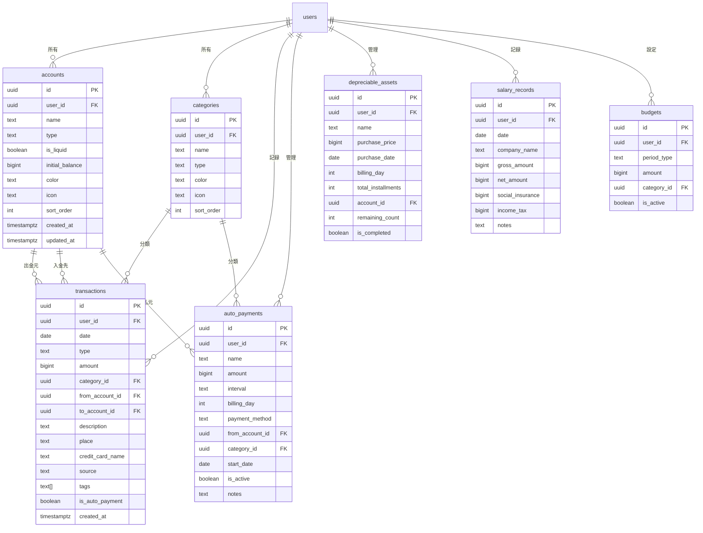
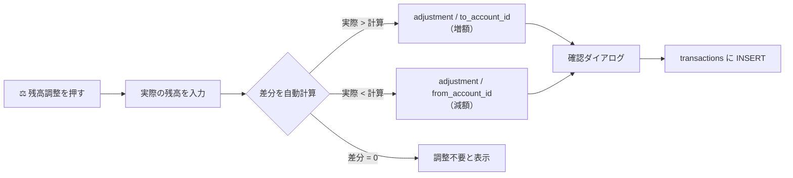
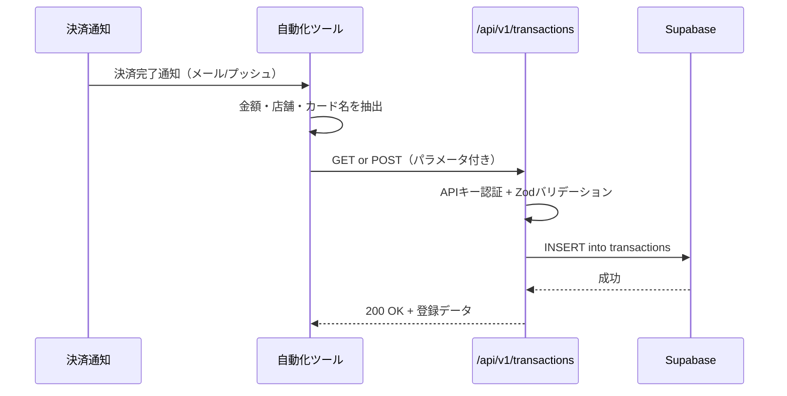

# 収支管理ウェブアプリ 仕様書

**バージョン**: 1.1  
**最終更新日**: 2026-03-03  
**ステータス**: レビュー待ち

> [!NOTE]
> **v1.2 変更点**: 残高調整（adjustment）機能を追加
> **v1.1 変更点**: クレジットカード名フィールド追加、クイック入力API（旧GAS連携の置き換え）を追加

---

## 1. プロジェクト概要

### 1.1 目的

現在 Google スプレッドシートで運用している個人の収支管理を、専用のウェブアプリケーションに置き換える。
手動更新への依存を排除し、取引入力から残高算出・分析までを自動化したパーソナルファイナンスツールを構築する。

### 1.2 背景と課題

現行スプレッドシート（シート構成: ダッシュボード / 検索 / 推移 / フォームの回答1 / 自動支払い管理 / 減価償却 / 給与まとめ / タベソダ処理 / 交通費精算書 / 高速道路処理）の分析により、以下の課題を特定した。

| # | 課題 | 影響度 |
|---|---|---|
| 1 | 口座残高を手動で更新する必要がある（最終チェック日が2〜14ヶ月前で停止） | 🔴 高 |
| 2 | 資金移動（口座間の振替）が金額0円で記録され、自動集計に反映されない | 🔴 高 |
| 3 | 「場所」列に店舗名と移動ルートが混在し、分析精度が低下 | 🟡 中 |
| 4 | 流動資産と非流動資産（NISA・償却資産）が混在し、可処分資金が不明瞭 | 🟡 中 |
| 5 | 予算目標がメモ書きで、実績との自動比較ができない | 🟡 中 |
| 6 | 専用シート（タベソダ・交通費・高速道路）が増え続けメンテが煩雑 | 🟢 低 |

### 1.3 スコープ

| 項目 | スコープ内 | スコープ外 |
|---|---|---|
| ユーザー | 個人利用（1ユーザー） | マルチユーザー・チーム共有 |
| プラットフォーム | Webブラウザ（PC・スマホ・タブレット） | ネイティブアプリ（iOS/Android） |
| データ入力 | 手動入力 + CSVインポート + **クイック入力API** | 銀行API自動連携 |
| 外部連携 | パラメータ付きURL（通知→自動投稿） | Webhook / バッチ処理 |
| 分析 | 月次/年次推移・カテゴリ分析 | AI予測・レコメンド |

---

## 2. 技術スタック

### 2.1 フロントエンド

| ライブラリ | バージョン | 用途 |
|---|---|---|
| **Next.js** | 15.x (App Router) | フレームワーク。SSR/SSGハイブリッド |
| **React** | 19.x | UI構築 |
| **TypeScript** | 5.x | 型安全性 |
| **Tailwind CSS** | v4 | スタイリング・レスポンシブ |
| **Recharts** | 2.x | グラフ描画 |
| **Lucide React** | 最新 | アイコン |
| **React Hook Form** | 7.x | フォーム管理 |
| **Zod** | 3.x | スキーマバリデーション |
| **TanStack Query** | 5.x | サーバー状態管理・キャッシュ |
| **date-fns** | 4.x | 日付操作 |

### 2.2 バックエンド

| サービス | 用途 |
|---|---|
| **Supabase** | PostgreSQLデータベース・認証・Row Level Security |

### 2.3 インフラ

| サービス | 用途 |
|---|---|
| **Vercel** | デプロイ・ホスティング・CI/CD |
| **GitHub** | ソースコード管理 |

---

## 3. データベース設計

### 3.1 ER図



### 3.2 テーブル定義

#### `accounts`（口座・財布）

口座・財布・電子マネー・クレジットカード・投資口座・償却資産をすべて管理する。

| カラム | 型 | NULL | デフォルト | 説明 |
|---|---|---|---|---|
| `id` | UUID | NO | `gen_random_uuid()` | 主キー |
| `user_id` | UUID | NO | - | `auth.users` 外部キー |
| `name` | TEXT | NO | - | 口座名（例: 住信SBI, 現金） |
| `type` | TEXT | NO | - | `bank` / `cash` / `credit` / `epay` / `investment` / `asset` |
| `is_liquid` | BOOLEAN | NO | `true` | 流動資産かどうか |
| `initial_balance` | BIGINT | NO | `0` | 開始残高（円）。移行時に設定 |
| `color` | TEXT | YES | - | UI表示用カラーコード |
| `icon` | TEXT | YES | - | Lucide アイコン名 |
| `sort_order` | INT | NO | `0` | 表示順 |
| `created_at` | TIMESTAMPTZ | NO | `now()` | 作成日時 |
| `updated_at` | TIMESTAMPTZ | NO | `now()` | 更新日時 |

**制約**:
- `type` は CHECK制約で上記6値に限定
- `user_id + name` にユニーク制約

**残高の算出方法**:
口座の現在残高はテーブルに保持せず、以下のクエリで都度算出する。

```sql
initial_balance
  + SUM(transactions.amount WHERE to_account_id = this AND type IN ('income', 'transfer'))
  - SUM(transactions.amount WHERE from_account_id = this AND type IN ('expense', 'transfer'))
```

#### `categories`（ジャンル）

支出・収入のカテゴリ分類。ユーザーが自由に追加・並び替え可能。

| カラム | 型 | NULL | デフォルト | 説明 |
|---|---|---|---|---|
| `id` | UUID | NO | `gen_random_uuid()` | 主キー |
| `user_id` | UUID | NO | - | `auth.users` 外部キー |
| `name` | TEXT | NO | - | カテゴリ名 |
| `type` | TEXT | NO | - | `expense` / `income` / `both` |
| `color` | TEXT | YES | - | UI表示色 |
| `icon` | TEXT | YES | - | Lucide アイコン名 |
| `sort_order` | INT | NO | `0` | 表示順 |

**初期データ**（ユーザー登録時に自動挿入）:

| 名前 | 種別 | 色 |
|---|---|---|
| 食品 | expense | #ef4444 |
| 間食 | expense | #f97316 |
| 趣味・娯楽 | expense | #8b5cf6 |
| 交通費 | expense | #3b82f6 |
| 固定費 | expense | #6b7280 |
| サブスク | expense | #ec4899 |
| 日用品 | expense | #14b8a6 |
| 便利アイテム | expense | #06b6d4 |
| 道具類 | expense | #a855f7 |
| 美容費 | expense | #ec4899 |
| 被服費 | expense | #f43f5e |
| 医療費 | expense | #10b981 |
| 通信費 | expense | #2563eb |
| 交際費 | expense | #d946ef |
| 減価償却 | expense | #78716c |
| 雑費 | expense | #9ca3af |
| 特別費 | expense | #eab308 |
| 給与 | income | #22c55e |
| フリーランス | income | #10b981 |
| その他収入 | income | #84cc16 |

#### `transactions`（取引記録）

すべての金銭の移動を記録する中心テーブル。旧スプレッドシートの「フォームの回答1」に相当。
**資金移動を正しく追跡するため、`from_account_id` / `to_account_id` の複式記帳方式を採用。**

| カラム | 型 | NULL | デフォルト | 説明 |
|---|---|---|---|---|
| `id` | UUID | NO | `gen_random_uuid()` | 主キー |
| `user_id` | UUID | NO | - | `auth.users` 外部キー |
| `date` | DATE | NO | - | 利用日 |
| `type` | TEXT | NO | - | `expense` / `income` / `transfer` / `adjustment` |
| `amount` | BIGINT | NO | - | 金額（円）。常に正の値 |
| `category_id` | UUID | YES | - | カテゴリ FK（transferの場合NULL可） |
| `from_account_id` | UUID | YES | - | 出金元口座 FK |
| `to_account_id` | UUID | YES | - | 入金先口座 FK（transfer / income時のみ） |
| `description` | TEXT | YES | - | 内容メモ |
| `place` | TEXT | YES | - | 場所（店舗名） |
| `credit_card_name` | TEXT | YES | - | クレジットカード名（例: 楽天カード, 三井住友VISA）|
| `source` | TEXT | NO | `'manual'` | 入力元。`manual` / `api` / `csv_import` |
| `tags` | TEXT[] | NO | `'{}'` | カスタムタグ配列 |
| `is_auto_payment` | BOOLEAN | NO | `false` | 固定費自動計上フラグ |
| `created_at` | TIMESTAMPTZ | NO | `now()` | 作成日時 |

**取引タイプ別の口座フィールド使用ルール**:

| type | from_account_id | to_account_id | 説明 |
|---|---|---|---|
| `expense` | ✅ 必須（出金元） | ❌ NULL | 支出。`from` の残高が減る |
| `income` | ❌ NULL | ✅ 必須（入金先） | 収入。`to` の残高が増える |
| `transfer` | ✅ 必須（出金元） | ✅ 必須（入金先） | 振替。`from` が減り `to` が増える |
| `adjustment` | 減額時✅ | 増額時✅ | 残高調整。**いずれか一方のみ設定**。収支集計から除外 |

> [!IMPORTANT]
> **`adjustment` は収支分析（ダッシュボード・月次/年次推移・カテゴリ別支出）から除外する。**
> 残高計算には含まれるが、「いくら使ったか/稼いだか」の指標には影響しない。

**制約**:
- `type` は CHECK制約で上記4値に限定
- `amount > 0` の CHECK制約
- `type = 'expense'` → `from_account_id IS NOT NULL`
- `type = 'income'` → `to_account_id IS NOT NULL`
- `type = 'transfer'` → 両方 NOT NULL かつ `from_account_id != to_account_id`
- `type = 'adjustment'` → `from_account_id` と `to_account_id` のいずれか一方のみ NOT NULL

**インデックス**:
- `(user_id, date DESC)` — 一覧表示用
- `(user_id, category_id)` — カテゴリ集計用
- `(user_id, from_account_id)` — 口座別フィルター用
- `(user_id, to_account_id)` — 口座別フィルター用
- `(user_id, credit_card_name)` — カード別フィルター用

**`credit_card_name` の使用ルール**:
- クレジットカード口座（`from_account_id` の `type = 'credit'`）で支払った場合に入力
- 複数のカードを1つのクレジットカード口座で管理しつつ、カード別の利用明細を参照可能にする
- UIでは `from_account_id` がクレジットカード口座の場合のみ、カード名の選択欄を表示
- カード名は自由入力 + 履歴からのサジェスト（`SELECT DISTINCT credit_card_name` で取得）

#### `auto_payments`（固定費）

毎月/毎年の定額支出を管理。旧スプレッドシートの「自動支払い管理」に相当。

| カラム | 型 | NULL | デフォルト | 説明 |
|---|---|---|---|---|
| `id` | UUID | NO | `gen_random_uuid()` | 主キー |
| `user_id` | UUID | NO | - | `auth.users` 外部キー |
| `name` | TEXT | NO | - | サービス名 |
| `amount` | BIGINT | YES | - | 金額（NULL = 変動制） |
| `interval` | TEXT | NO | - | `monthly` / `yearly` |
| `billing_day` | INT | YES | - | 決済日（1〜31。NULL = 不定） |
| `payment_method` | TEXT | YES | - | 支払方法メモ |
| `from_account_id` | UUID | YES | - | 引き落とし口座 FK |
| `category_id` | UUID | YES | - | カテゴリ FK |
| `start_date` | DATE | YES | - | 契約開始日 |
| `is_active` | BOOLEAN | NO | `true` | 有効/停止 |
| `notes` | TEXT | YES | - | 備考 |

#### `depreciable_assets`（減価償却資産）

高額購入品を月次で按分計上する。旧スプレッドシートの「減価償却」に相当。

| カラム | 型 | NULL | デフォルト | 説明 |
|---|---|---|---|---|
| `id` | UUID | NO | `gen_random_uuid()` | 主キー |
| `user_id` | UUID | NO | - | `auth.users` 外部キー |
| `name` | TEXT | NO | - | 資産名 |
| `purchase_price` | BIGINT | NO | - | 購入金額 |
| `purchase_date` | DATE | NO | - | 購入日 |
| `billing_day` | INT | YES | `1` | 月次計上日 |
| `total_installments` | INT | NO | - | 総分割回数 |
| `account_id` | UUID | YES | - | 費用計上先口座 FK |
| `remaining_count` | INT | NO | - | 残り回数 |
| `is_completed` | BOOLEAN | NO | `false` | 償却完了フラグ |

**月額計算**: `purchase_price / total_installments`（端数は最終月で調整）

#### `salary_records`（給与記録）

| カラム | 型 | NULL | デフォルト | 説明 |
|---|---|---|---|---|
| `id` | UUID | NO | `gen_random_uuid()` | 主キー |
| `user_id` | UUID | NO | - | `auth.users` 外部キー |
| `date` | DATE | NO | - | 支給年月 |
| `company_name` | TEXT | NO | - | 企業/クライアント名 |
| `gross_amount` | BIGINT | NO | - | 額面 |
| `net_amount` | BIGINT | NO | - | 手取り |
| `social_insurance` | BIGINT | NO | `0` | 社会保険料 |
| `income_tax` | BIGINT | NO | `0` | 所得税 |
| `notes` | TEXT | YES | - | 備考 |

#### `budgets`（予算設定）

旧スプレッドシートのメモ書き予算をデータ化。

| カラム | 型 | NULL | デフォルト | 説明 |
|---|---|---|---|---|
| `id` | UUID | NO | `gen_random_uuid()` | 主キー |
| `user_id` | UUID | NO | - | `auth.users` 外部キー |
| `period_type` | TEXT | NO | - | `monthly` / `yearly` |
| `amount` | BIGINT | NO | - | 予算額 |
| `category_id` | UUID | YES | - | カテゴリFK（NULL = 全体予算） |
| `is_active` | BOOLEAN | NO | `true` | 有効フラグ |

### 3.3 Row Level Security (RLS)

すべてのテーブルに共通で以下の RLS ポリシーを適用:

```sql
-- 例: transactions テーブル
ALTER TABLE transactions ENABLE ROW LEVEL SECURITY;

CREATE POLICY "Users can only access their own data"
ON transactions FOR ALL
USING (auth.uid() = user_id)
WITH CHECK (auth.uid() = user_id);
```

---

## 4. 画面設計

### 4.1 ナビゲーション構造

```
/ (ダッシュボード)
├── /transactions (取引一覧・検索)
│   └── /transactions/new (取引入力フォーム)
├── /assets (資産管理)
├── /auto-payments (固定費管理)
├── /depreciation (減価償却管理)
├── /salary (給与管理)
├── /analytics (分析・推移)
├── /settings (設定)
│   ├── カテゴリ管理
│   ├── 口座管理
│   ├── 予算設定
│   └── APIキー管理
└── /api/v1/transactions (クイック入力API)
```

### 4.2 レスポンシブ設計

| ブレークポイント | ナビゲーション | レイアウト |
|---|---|---|
| スマートフォン (< 768px) | ボトムナビバー（主要5項目） | 1カラム |
| タブレット (768px〜1024px) | 折りたたみサイドバー | 2カラム |
| PC (> 1024px) | 固定サイドバー (w-64) | 2〜3カラム |

### 4.3 各画面の仕様

#### 4.3.1 🏠 ダッシュボード（`/`）

**目的**: 今月の財務状況を一目で把握する

**レイアウト**:

```
┌─────────────────────────────────────────────┐
│  全資産合計 │ 流動資産 │ 今月収入 │ 今月支出  │  ← 4カードグリッド
├─────────────────────────────────────────────┤
│  月間予算プログレスバー                       │
├──────────────────┬──────────────────────────┤
│ 支出内訳ドーナツ │   月別収支棒グラフ        │  ← 2カラム
├──────────────────┴──────────────────────────┤
│  最近の取引一覧（直近8件）                    │
└─────────────────────────────────────────────┘
```

**要素の詳細**:

| 要素 | データソース | 仕様 |
|---|---|---|
| 全資産合計 | 全口座 `initial_balance + 取引差分` の合計 | 投資・償却含む旨を注記 |
| 流動資産 | `is_liquid = true` の口座のみ合計 | 「すぐ使えるお金」とラベル |
| 今月収入 | 当月 `type = income` の SUM（**adjustment除外**） | 緑色表示 |
| 今月支出 | 当月 `type = expense` の SUM（**adjustment除外**） | 赤色 or 白色。収支を副テキスト表示 |
| 予算プログレス | `budgets` テーブルの月次予算 vs 当月支出合計 | 0-80%: 緑, 80-100%: 黄, 100%超: 赤 |
| 支出内訳 | 当月支出をカテゴリ別にGROUP BY | ドーナツチャート + 上位6カテゴリのリスト |
| 月別収支 | 直近3ヶ月分の月次集計 | 収入=緑 / 支出=赤 の棒グラフ |
| 最近の取引 | 取引を日付降順で8件 | タップで取引詳細に遷移 |

#### 4.3.2 📝 取引入力（`/transactions/new`）

**目的**: 支出・収入・移動を素早く入力する（特にスマホ）

**UI仕様**:

- 上部に **支出 / 収入 / 移動 / 調整** タブ切り替え
- 金額入力は大きなフォントで中央表示
- カテゴリ選択は **アイコングリッド**（3×n、スクロール可能）
- 口座選択は **横スクロールのカードリスト**
- 移動タブでは「FROM → TO」の矢印付き口座選択

**入力フィールド**:

| フィールド | 必須 | 型 | バリデーション |
|---|---|---|---|
| 日付 | ✅ | DATE | デフォルト=今日。未来日は警告 |
| 金額 | ✅ | BIGINT | > 0。Max 99,999,999 |
| カテゴリ | 支出/収入時✅ | UUID | マスタから選択 |
| 出金元口座 | 支出/移動時✅ | UUID | マスタから選択 |
| 入金先口座 | 収入/移動時✅ | UUID | マスタから選択。移動時は出金元と異なること |
| カード名 | ❌ | TEXT | **出金元がクレカ口座の場合のみ表示**。過去履歴からサジェスト |
| 内容 | ❌ | TEXT | Max 200文字 |
| 場所 | ❌ | TEXT | Max 100文字 |
| タグ | ❌ | TEXT[] | 自由入力（カンマ区切り） |

**カード名の条件付き表示ロジック**:
- `from_account_id` で選択された口座の `type` が `credit` の場合のみ「カード名」フィールドを表示
- `SELECT DISTINCT credit_card_name FROM transactions WHERE user_id = ? AND credit_card_name IS NOT NULL` で過去に使用したカード名をサジェストリストとして表示
- 新しいカード名の自由入力も可能

#### 4.3.3 📋 取引一覧（`/transactions`）

**目的**: 過去の取引を検索・閲覧する

**機能**:

| 機能 | 仕様 |
|---|---|
| テキスト検索 | `description`, `place`, `category.name` を部分一致 |
| 種別フィルター | すべて / 支出 / 収入 / 移動 / 調整 |
| カテゴリフィルター | ドロップダウン（複数選択可） |
| 口座フィルター | ドロップダウン |
| **カード名フィルター** | ドロップダウン（DISTINCT取得）。クレカ利用分のみに絞り込み |
| 期間フィルター | 日付範囲ピッカー |
| ソート | 日付順（昇/降） |
| ページネーション | 無限スクロール（30件ずつ読み込み） |

**表示**:
- **PC**: テーブル形式（日付・種別・内容・ジャンル・場所・口座・**カード名**・金額）
- **スマホ**: カード形式（アイコン + 説明 + 金額。カード名はサブテキスト表示）

#### 4.3.4 💰 資産管理（`/assets`）

**目的**: 口座残高の全体像と内訳を把握する

**要素**:

| 要素 | 仕様 |
|---|---|
| 全資産合計 | 全口座のSUM |
| 流動資産 | `is_liquid = true` のSUM。緑色のカード |
| 非流動資産 | `is_liquid = false` のSUM。紫色のカード |
| 口座別棒グラフ | 横棒グラフ。負債(クレカ)は赤色 |
| 口座一覧 | 流動/非流動に分けてリスト表示 |
| 口座クリック | 当該口座の取引一覧を表示（フィルタ適用済み） |
| **残高調整ボタン** | 各口座に ⚖️ アイコンで表示。下記の調整フローを起動 |

> [!IMPORTANT]
> **残高はDBに保存しない。** `initial_balance` + 取引の差分合計で都度算出する。
> これにより、取引データが真実の唯一のソース (Single Source of Truth) となり、手動更新のミスが原理的に発生しない。

**残高調整フロー**:



| ステップ | 内容 |
|---|---|
| 1. ボタン押下 | 対象口座の「残高調整」をクリック |
| 2. 残高入力 | 「実際の残高」を入力するモーダルが表示 |
| 3. 差分表示 | システムが `計算残高` と `入力残高` の差分を自動表示 |
| 4. メモ入力 | 任意で調整理由を入力（例: 「通帳記帳で確認」） |
| 5. 確認・保存 | 確認ダイアログ後、`type = 'adjustment'` の取引を自動作成 |

**自動生成される取引レコード**:
- `type`: `adjustment`
- `amount`: `abs(実際の残高 - 計算残高)`
- `from_account_id` / `to_account_id`: 差分の方向に応じていずれかを設定
- `description`: `残高調整: ¥{計算残高} → ¥{実際の残高}`（自動生成 + ユーザーのメモ）
- `category_id`: NULL
- `source`: `manual`

#### 4.3.5 📅 固定費管理（`/auto-payments`）

**目的**: 毎月の定額支出を把握・管理する

**要素**:

| 要素 | 仕様 |
|---|---|
| 月額固定費合計 | `amount IS NOT NULL AND is_active` の SUM |
| 登録件数 | 全件数 / 有効件数 |
| 一覧テーブル | サービス名・金額・頻度・決済日・カテゴリ・支払方法・状況 |
| 次回決済アラート | 決済日が7日以内の項目に ⏰ アイコン表示 |
| CRUD | 追加・編集・停止・削除 |

#### 4.3.6 📦 減価償却管理（`/depreciation`）

**目的**: 高額購入品の月次償却を管理する

**要素**:

| 要素 | 仕様 |
|---|---|
| 月額償却費合計 | 償却中資産の月額 SUM |
| 償却中一覧 | プログレスバー付きカード。残回数・残額表示 |
| 完了済み | 折りたたみリスト |
| 新規登録 | 品名・金額・購入日・分割回数 |

#### 4.3.7 💼 給与管理（`/salary`）

**目的**: 複数の収入源（勤務先・フリーランス）の給与を記録・分析する

**要素**:

| 要素 | 仕様 |
|---|---|
| 手取り/額面/控除 合計 | 3枚のサマリーカード |
| 月別推移グラフ | 手取り(緑) + 控除(赤) のスタック棒グラフ |
| 企業別サマリー | 企業名・合計額・回数 |
| 明細テーブル | 年月・企業名・額面・社保・税金・手取り |

#### 4.3.8 📊 分析・推移（`/analytics`）

**目的**: 長期的な財務トレンドを分析する

**チャート一覧**:

| チャート | 種類 | データ |
|---|---|---|
| 年次推移 | ComposedChart（棒+折れ線） | 期末資産（棒）+ 年間収支（線） |
| 年間サマリー | テーブル | 年・収入・支出・収支・期末資産 |
| 月次推移 | AreaChart | 収入・支出の推移 |
| ジャンル別ランキング | 水平バー | ジャンル別支出額（降順） |

**フィルター**: 年選択、期間カスタム選択（日付レンジピッカー）

> [!NOTE]
> すべてのチャート・集計テーブルで `type = 'adjustment'` の取引は **除外** する。
> 調整は残高の修正であり、実際の収入・支出ではないため。

#### 4.3.9 ⚙️ 設定（`/settings`）

**サブページ**:

| 設定 | 機能 |
|---|---|
| カテゴリ管理 | 追加・編集・並べ替え・削除。色・アイコン選択 |
| 口座管理 | 追加・編集・並べ替え・削除。タイプ・流動性設定 |
| 予算設定 | 月次全体予算の設定。カテゴリ別予算（オプション） |
| **APIキー管理** | クイック入力API用のキー発行・無効化・履歴確認 |
| データエクスポート | CSV出力 |
| データインポート | CSVアップロード（既存スプレッドシートからの移行用） |

---

### 4.4 クイック入力API（`/api/v1/transactions`）

旧スプレッドシートでは、メールやスマホの決済通知からGAS（Google Apps Script）にパラメータ付きURLでアクセスし、自動的に取引を記録していた。この機能をNext.js API Routeで再実装する。

#### 4.4.1 概要



#### 4.4.2 エンドポイント

**`GET /api/v1/transactions`** — クエリパラメータで取引追加（URLをそのまま叩ける）

**`POST /api/v1/transactions`** — JSONボディで取引追加（より柔軟）

#### 4.4.3 認証

| 方式 | 詳細 |
|---|---|
| APIキー | `X-API-Key` ヘッダー、または `?api_key=` クエリパラメータ |
| キー管理 | 設定画面でキーを生成・無効化。ハッシュ化してDBに保存 |
| レート制限 | 1分あたり30リクエスト |

> [!IMPORTANT]
> クエリパラメータでの `api_key` 送信はURLに認証情報が残るリスクがあるが、個人利用かつ自動化ツールからのアクセスを想定しているため許容する。より安全にするにはヘッダー方式を推奨。

#### 4.4.4 リクエストパラメータ

**GETの場合（クエリパラメータ）**:

```
GET /api/v1/transactions?api_key=sk_xxxxx
  &amount=1500
  &description=スターバックス
  &place=飲食店
  &category=食品
  &account=クレジットカード
  &card=楽天カード
  &date=2026-03-03
  &type=expense
  &tags=カフェ
```

**POSTの場合（JSONボディ）**:

```json
{
  "amount": 1500,
  "description": "スターバックス",
  "place": "飲食店",
  "category": "食品",
  "account": "クレジットカード",
  "card": "楽天カード",
  "date": "2026-03-03",
  "type": "expense",
  "tags": ["カフェ"]
}
```

| パラメータ | 必須 | 型 | デフォルト | 説明 |
|---|---|---|---|---|
| `amount` | ✅ | number | - | 金額（正の整数） |
| `type` | ❌ | string | `expense` | `expense` / `income` / `transfer` |
| `description` | ❌ | string | `null` | 内容メモ |
| `place` | ❌ | string | `null` | 場所 |
| `category` | ❌ | string | `null` | カテゴリ名（名前で検索→UUID変換） |
| `account` | ❌ | string | デフォルト口座 | 口座名（名前で検索→UUID変換） |
| `to_account` | ❌ | string | `null` | 移動先口座名（transfer時のみ） |
| `card` | ❌ | string | `null` | クレジットカード名 |
| `date` | ❌ | string | 今日 | `YYYY-MM-DD` 形式 |
| `tags` | ❌ | string | `null` | カンマ区切り（GETの場合）/ 配列（POST） |

> [!TIP]
> `category` と `account` は **名前（日本語）で指定可能**。UUIDを覚える必要はない。
> 部分一致で最初にマッチしたものを使用する（例: `category=食` → `食品` にマッチ）。

#### 4.4.5 レスポンス

**成功時 (200)**:
```json
{
  "success": true,
  "data": {
    "id": "a1b2c3d4-...",
    "date": "2026-03-03",
    "type": "expense",
    "amount": 1500,
    "description": "スターバックス",
    "place": "飲食店",
    "category": "食品",
    "account": "クレジットカード",
    "credit_card_name": "楽天カード",
    "source": "api"
  }
}
```

**エラー時 (400/401/429)**:
```json
{
  "success": false,
  "error": {
    "code": "INVALID_AMOUNT",
    "message": "金額は1以上の整数で指定してください"
  }
}
```

| HTTPステータス | エラーコード | 説明 |
|---|---|---|
| 400 | `INVALID_AMOUNT` | 金額が不正 |
| 400 | `INVALID_DATE` | 日付フォーマットが不正 |
| 400 | `CATEGORY_NOT_FOUND` | 指定カテゴリ名が見つからない |
| 400 | `ACCOUNT_NOT_FOUND` | 指定口座名が見つからない |
| 401 | `UNAUTHORIZED` | APIキーが無効 |
| 429 | `RATE_LIMITED` | レート制限超過 |

#### 4.4.6 APIキー管理テーブル

```sql
CREATE TABLE api_keys (
  id UUID PRIMARY KEY DEFAULT gen_random_uuid(),
  user_id UUID REFERENCES auth.users NOT NULL,
  name TEXT NOT NULL,              -- キーの名前（例: 「iPhone通知用」）
  key_hash TEXT NOT NULL,          -- SHA-256 ハッシュ
  key_prefix TEXT NOT NULL,        -- 先頭8文字（表示用: sk_xxxxxxxx...）
  last_used_at TIMESTAMPTZ,
  is_active BOOLEAN DEFAULT true,
  created_at TIMESTAMPTZ DEFAULT now()
);
```

#### 4.4.7 想定される利用シナリオ

| シナリオ | ツール | 処理フロー |
|---|---|---|
| クレカ決済通知 | iOS ショートカット / Tasker | プッシュ通知をトリガー → 正規表現で金額・店舗抽出 → GETリクエスト |
| メール通知 | Zapier / IFTTT / GAS | メール受信をトリガー → 本文パース → POSTリクエスト |
| 手動クイック入力 | ブラウザのブックマーク | パラメータ付きURLをブックマーク → タップで即登録 |
| バッチ処理 | Node.jsスクリプト | CSVを読み込み → ループでPOSTリクエスト |

---

## 5. 認証・セキュリティ

### 5.1 認証方式

- **Supabase Auth** のメール/パスワード認証
- ログインページ（`/login`）で認証後、ダッシュボードにリダイレクト
- 未認証アクセスはすべて`/login`にリダイレクト

### 5.2 セキュリティ要件

| 項目 | 対策 |
|---|---|
| データアクセス制御 | RLS で自ユーザーのデータのみアクセス可能 |
| 入力バリデーション | Zod スキーマによるクライアント＋サーバーサイドバリデーション |
| XSS対策 | React の自動エスケープ + CSP ヘッダー |
| HTTPS | Vercel デフォルトで有効 |
| API認証 | APIキーのSHA-256ハッシュ比較。生キーはDB非保存 |
| APIレート制限 | 1分30リクエスト。超過時は429を返却 |

---

## 6. 非機能要件

### 6.1 パフォーマンス

| 指標 | 目標 |
|---|---|
| 初回読み込み（LCP） | < 2.5秒 |
| ページ遷移 | < 300ms（App Router のクライアントナビゲーション） |
| 取引一覧の表示 | 1000件でも < 1秒（ページネーション適用時） |
| グラフ描画 | < 500ms |

### 6.2 ユーザビリティ

| 項目 | 仕様 |
|---|---|
| テーマ | ダークモード固定（変更不可） |
| 言語 | 日本語固定 |
| 通貨 | 日本円（JPY）固定。小数点なし |
| アクセシビリティ | WCAG 2.1 レベルAA準拠を目標 |

### 6.3 データ整合性

| ルール | 実装 |
|---|---|
| 残高計算 | 取引データから都度算出。キャッシュは TanStack Query で管理 |
| 移動の整合性 | `from` と `to` が同額で処理される。不整合は原理的に発生しない |
| 削除時の影響 | 取引削除は論理削除ではなく物理削除。ただし確認ダイアログを表示 |

---

## 7. データ移行計画

### 7.1 対象データ

| シート | 移行先テーブル | 推定件数 |
|---|---|---|
| フォームの回答1 | `transactions` | 〜3,000件（2020年〜） |
| 自動支払い管理 | `auto_payments` | 〜10件 |
| 減価償却 | `depreciable_assets` | 〜10件 |
| 給与まとめ | `salary_records` | 〜50件 |
| ダッシュボード（残高） | `accounts.initial_balance` | 〜15口座 |

### 7.2 移行手順

1. スプレッドシートから各シートをCSVエクスポート
2. 移行スクリプト（Node.js）で以下を実行:
   - カラム名のマッピング
   - `場所` 列から移動ルート（例: 「楽天銀行から現金」）を検出し、`transfer` タイプに自動変換
   - `移動` ジャンルかつ金額0円のエントリは、備考欄のルート情報から金額と口座を推定
   - カテゴリ名→UUID のマッピング
3. Supabase にバルクインサート
4. 移行後の数値照合（月次合計をスプレッドシートと比較）

---

## 8. 実装フェーズ

| Phase | 内容 | 依存 | 目安 |
|---|---|---|---|
| **1** | 環境構築・DB作成・認証・RLS | なし | 1〜2日 |
| **2** | 口座・カテゴリ CRUD + 取引入力・一覧 | Phase 1 | 3〜5日 |
| **3** | ダッシュボード・グラフ・残高自動計算 | Phase 2 | 2〜3日 |
| **4** | 固定費・減価償却・給与管理 | Phase 2 | 2〜3日 |
| **5** | 分析ページ・設定・データ移行 | Phase 3, 4 | 2〜3日 |
| **6** | テスト・Vercelデプロイ・本番移行 | Phase 5 | 1〜2日 |

---

## 9. テスト計画

### 9.1 ユニットテスト

| テスト対象 | 内容 |
|---|---|
| 残高計算ロジック | 複数取引後の口座残高が期待値と一致するか |
| Zod バリデーション | 各入力フォームの正常/異常系 |
| 日付フィルター | 月次・年次の集計が正しく算出されるか |

### 9.2 結合テスト

| テスト対象 | 内容 |
|---|---|
| RLS ポリシー | ユーザーAのデータにユーザーBがアクセスできないこと |
| 取引→残高反映 | 取引INSERT → 残高クエリの結果が正しいこと |
| 取引削除→残高更新 | 取引DELETE → 残高が正しく戻ること |

### 9.3 API テスト

| テスト対象 | 内容 |
|---|---|
| 認証 | 無効なAPIキーで401が返ること |
| GET取引追加 | クエリパラメータで取引が正常に追加されること |
| POST取引追加 | JSONボディで取引が正常に追加されること |
| 名前→UUID解決 | カテゴリ名・口座名が正しく解決されること |
| レート制限 | 31回連続リクエストで429が返ること |
| カード名 | `card` パラメータが `credit_card_name` に反映されること |
| `source` フィールド | API経由の取引に `source = 'api'` が設定されること |

### 9.4 E2Eテスト（手動）

1. PC / スマホで取引を1件ずつ入力（支出・収入・移動）
2. **クレカ口座選択時にカード名フィールドが表示されることを確認**
3. **カード名フィルターで特定カードの取引のみ表示されることを確認**
4. ダッシュボードの数値反映を確認
5. 取引一覧の検索・フィルター動作確認
6. 資産管理の残高自動計算確認
7. 各グラフの表示確認
8. **クイック入力API にcurlでリクエストを送信し、取引一覧に反映されることを確認**
9. スプレッドシートの月次合計との照合

---

## 付録A: スプレッドシート → ウェブアプリ 対応表

| スプレッドシート機能 | ウェブアプリ機能 | 改善内容 |
|---|---|---|
| ダッシュボード | ダッシュボード画面 | 残高リアルタイム自動計算 |
| フォームの回答1（Google Form連携） | 取引入力フォーム | 複式記帳。スマホ最適化UI |
| 残高管理テーブル（手動更新） | 資産管理画面 | 取引から自動算出 |
| 推移シート | 分析画面 | インタラクティブチャート |
| 自動支払い管理 | 固定費管理 | 次回決済アラート |
| 減価償却シート | 減価償却管理 | プログレスバー・自動完了 |
| 給与まとめ | 給与管理 | 企業別集計・推移グラフ |
| 検索シート | 全画面共通検索 | リアルタイム絞り込み |
| タベソダ/高速道路/交通費 各シート | タグ機能 | シート不要。タグで柔軟分類 |
| 予算目標メモ | 予算設定 + 自動比較 | プログレスバー表示 |
| **GAS連携（パラメータ付きURL）** | **クイック入力API** | Next.js API Route化。APIキー認証・エラーハンドリング強化 |
| **なし** | **カード名フィルター** | クレカごとの利用明細を即時参照可能 |

## 付録B: 口座初期データ

現在のスプレッドシートに基づく口座一覧:

| 口座名 | 種別 | 流動性 | 備考 |
|---|---|---|---|
| 現金 | cash | ✅ | 財布 |
| 楽天銀行 | bank | ✅ | |
| ゆうちょ | bank | ✅ | 家賃引き落とし |
| 三井住友銀行 | bank | ✅ | |
| 住信SBIネット銀行 | bank | ✅ | メイン口座 |
| PayPay | epay | ✅ | |
| PASMO | epay | ✅ | |
| メルペイ | epay | ✅ | |
| Amazonギフト | epay | ✅ | |
| クレジットカード | credit | ✅ | 負債（残高マイナス） |
| LINEPay | epay | ✅ | |
| majica | epay | ✅ | |
| GMOあおぞら銀行 | bank | ✅ | |
| 貯金箱 | cash | ✅ | |
| SBI積立NISA | investment | ❌ | 長期投資 |
| SBI証券 | investment | ❌ | 長期投資 |
| 償却資産 | asset | ❌ | 減価償却の簿価合計 |
